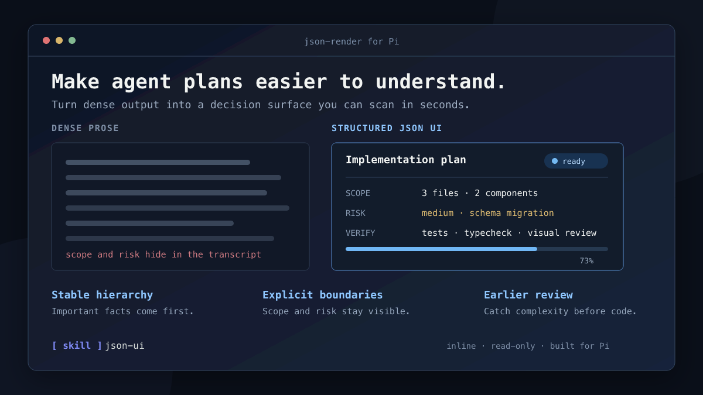
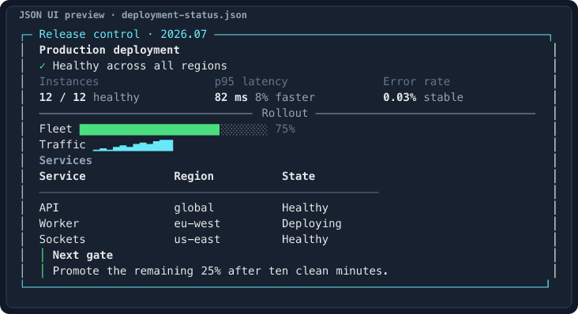
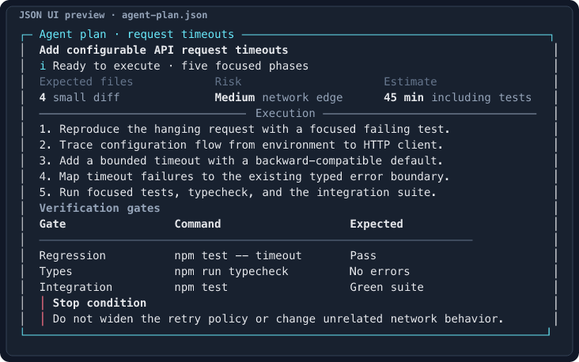
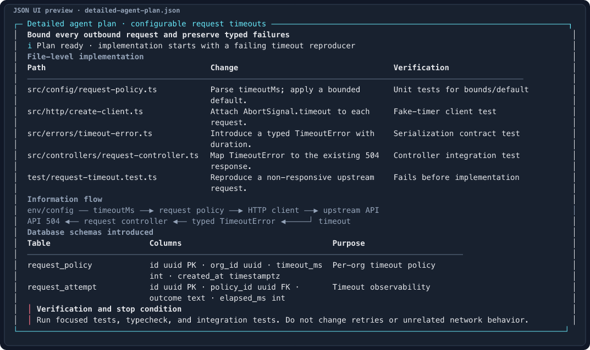

# json-render for Pi



## Install in Pi

```bash
pi install git:github.com/sharanry/json-render-pi
```

Start Pi normally. The included skill teaches your agent when structured UI is
clearer than prose; there is no command to learn and no separate window to
open.

> Pi packages run with full system access. Review third-party package source
> before installing it.

## See the signal, not the transcript

### Check deployment health at a glance



[View the source spec](examples/deployment-status.json)

### Understand an agent's plan quickly



[View the source spec](examples/agent-plan.json)

### Review detailed work without losing structure

File paths, information flow, database schemas, verification steps, and stop
conditions stay organized even in a detailed plan.



[View the source spec](examples/detailed-agent-plan.json)

## Preview and develop renderings

Run the included Storybook to browse every curated example with a live terminal-width control:

```bash
npm install
npm run storybook
```

Open `http://localhost:6006`, choose an example in the sidebar, and adjust **Width** in the Controls panel. Open **Configurable dashboard** to add any supported leaf component, edit its props as JSON, reorder or remove it, and change terminal width with a live slider. The previews use the production validator and renderer, so wrapping and validation behavior match the Pi extension.

For a production-static preview, run `npm run storybook:build`; output is written to `storybook-static/`.

## Built for trustworthy agent communication

- **Easy to scan:** hierarchy, spacing, color, and alignment expose what matters.
- **Inline by default:** structured results remain part of the conversation.
- **Readable at terminal widths:** long text and table cells wrap cleanly.
- **Safe to render:** malformed, oversized, or unsupported UI is rejected.
- **Focused on communication:** output is read-only, so it never pretends that
  buttons or actions work.

## License

[MIT](LICENSE) © 2026 Sharan Yalburgi
